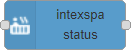

# node-red-contrib-intexspa

Intex SPA nodes to control the hot tub with Node-RED.

## Description

This contrib module provides a simple node to get the current status of a hot tub.

## Nodes

### intexspa status

Node to get the current state of an Intex SPA hot tub.

### intexspa action

Set the state of the Intex SPA hot tub, e.g. start and stop heating.

## Troubleshooting

The following issues can occur, if the Intex SPA account and device are not configured correctly:

| Error                                        | Possible Cause                                                                           |
| -------------------------------------------- | ---------------------------------------------------------------------------------------- |
| Request failed with status code 400          | Username or password is wrong.                                                           |
| Device with device name _MyDevice_ not found | The device name is wrong. Check the device name (aka Product Name in the Intex SPA app). |

## Constraint

This module is not associated with the Intex Recreation Corp.

This software is provided "as is", without any guarantees on the function and operation of the Intex devices. You use it at your own risk. For more details, check the license terms.

Icons created by [Radhe Icon - Flaticon](https://www.flaticon.com/free-icons/ui).
